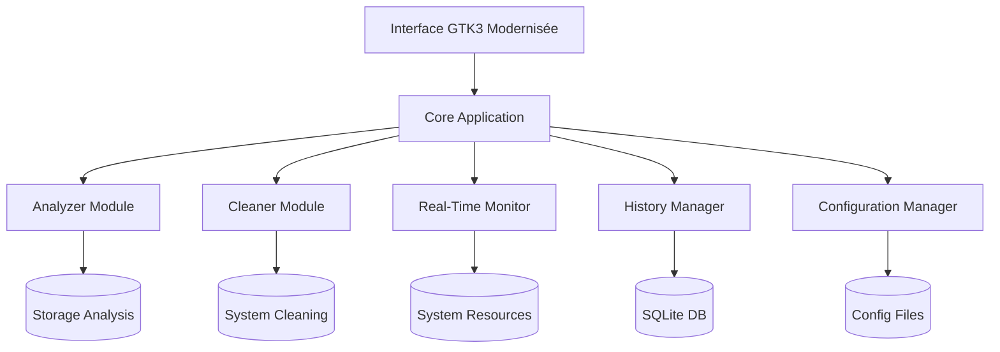

# Design Document: Interface Moderne Avancée

## Overview

Cette conception transforme le Debian Storage Analyzer existant en une application moderne avec une interface graphique avancée, des fonctionnalités d'analyse étendues, et une expérience utilisateur enrichie. Le design maintient la philosophie de sécurité existante (PolicyKit) et l'intégration Debian native tout en ajoutant des capacités visuelles et interactives sophistiquées.

L'architecture suit le pattern MVC existant avec des améliorations modulaires : interface utilisateur modernisée (View), logique d'analyse étendue (Model), et contrôleurs enrichis pour gérer les nouvelles interactions.

## Architecture

### Architecture Globale



### Modules Principaux

1. **Interface Utilisateur (UI)** : GTK3 avec sidebar moderne, graphiques interactifs
2. **Analyzer Extended** : Analyse avancée avec catégorisation et détection de doublons
3. **Cleaner Enhanced** : Nettoyage intelligent avec dry-run et planification
4. **Real-Time Monitor** : Surveillance système temps réel
5. **History Manager** : Gestion de l'historique et génération de rapports
6. **Configuration Manager** : Gestion des préférences utilisateur

## Components and Interfaces

### 1. Interface Utilisateur Modernisée

#### Sidebar Navigation
```python
class ModernSidebar:
    sections = ["Dashboard", "Analyse", "Nettoyage", "Historique", "Paramètres"]
    
    def create_sidebar(self) -> Gtk.StackSidebar:
        # Sidebar avec icônes et transitions fluides
        pass
```

#### Interactive Charts
```python
class InteractiveCharts:
    def create_histogram(self, data: List[FileInfo]) -> FigureCanvas:
        # Histogramme interactif avec matplotlib
        # Permet drill-down dans les sous-dossiers
        pass
    
    def create_pie_chart(self, categories: Dict[str, int]) -> FigureCanvas:
        # Camembert par type de fichier
        pass
```

#### Enhanced TreeView
```python
class EnhancedTreeView:
    def setup_sortable_columns(self):
        # Colonnes triables : Nom, Taille, Date, Type
        pass
    
    def setup_filtering(self):
        # Filtrage dynamique par taille, date, type
        pass
    
    def setup_drag_drop(self):
        # Support drag & drop depuis Nautilus
        pass
```

### 2. Analyzer Extended

#### File Categorization
```python
class FileCategorizer:
    categories = {
        'images': ['.jpg', '.png', '.gif', '.bmp', '.svg'],
        'videos': ['.mp4', '.avi', '.mkv', '.mov', '.wmv'],
        'documents': ['.pdf', '.doc', '.docx', '.txt', '.odt'],
        'archives': ['.zip', '.tar', '.gz', '.rar', '.7z'],
        'packages': ['.deb', '.rpm', '.snap', '.flatpak']
    }
    
    def categorize_file(self, filepath: str) -> str:
        # Catégorise un fichier selon son extension
        pass
```

#### Duplicate Detection
```python
class DuplicateDetector:
    def find_duplicates(self, directory: str) -> Dict[str, List[str]]:
        # Détection de doublons par hash SHA-256
        # Optimisation : comparaison de taille d'abord
        pass
    
    def calculate_file_hash(self, filepath: str) -> str:
        # Hash SHA-256 avec lecture par chunks pour gros fichiers
        pass
```

#### Analysis History
```python
class AnalysisHistory:
    def save_analysis(self, results: AnalysisResult):
        # Sauvegarde en SQLite avec timestamp
        pass
    
    def get_history_trends(self) -> List[HistoryPoint]:
        # Évolution de l'utilisation dans le temps
        pass
```

### 3. Cleaner Enhanced

#### Dry-Run Mode
```python
class DryRunCleaner:
    def simulate_cleaning(self, targets: List[str]) -> CleaningPreview:
        # Simulation sans suppression réelle
        # Calcul de l'espace qui serait libéré
        pass
```

#### Scheduled Cleaning
```python
class ScheduledCleaner:
    def setup_systemd_timer(self, schedule: str):
        # Intégration avec systemd pour nettoyage automatique
        pass
    
    def setup_cron_job(self, schedule: str):
        # Fallback avec cron si systemd indisponible
        pass
```

#### Application-Specific Cleaners
```python
class ApplicationCleaners:
    def clean_browser_cache(self, browser: str) -> int:
        # Firefox, Chromium, etc.
        pass
    
    def clean_snap_cache(self) -> int:
        # Cache Snap (nécessite root)
        pass
    
    def clean_thumbnails(self) -> int:
        # Miniatures d'images
        pass
```

### 4. Real-Time Monitor

#### System Resources Monitor
```python
class SystemMonitor:
    def __init__(self):
        self.update_interval = 2  # secondes
    
    def get_disk_usage(self) -> DiskUsage:
        # Utilisation disque temps réel
        pass
    
    def get_system_resources(self) -> SystemResources:
        # CPU, RAM, I/O
        pass
    
    def setup_notifications(self):
        # Alertes via libnotify
        pass
```

#### Notification System
```python
class NotificationManager:
    def send_desktop_notification(self, title: str, message: str, urgency: str):
        # Notifications via gi.repository.Notify
        pass
    
    def check_disk_space_alerts(self):
        # Vérification seuils critiques
        pass
```

### 5. Configuration Manager

#### Settings Management
```python
class ConfigurationManager:
    config_path = "~/.config/debian-storage-analyzer/config.json"
    
    def load_settings(self) -> Dict:
        # Chargement configuration JSON
        pass
    
    def save_settings(self, settings: Dict):
        # Sauvegarde avec validation
        pass
    
    def get_default_directories(self) -> List[str]:
        # Dossiers par défaut à analyser
        pass
```

## Data Models

### Core Data Structures

```python
@dataclass
class FileInfo:
    path: str
    size: int
    is_dir: bool
    category: str
    last_modified: datetime
    hash: Optional[str] = None

@dataclass
class AnalysisResult:
    timestamp: datetime
    directory: str
    total_size: int
    file_count: int
    categories: Dict[str, CategoryStats]
    largest_files: List[FileInfo]
    duplicates: Dict[str, List[str]]

@dataclass
class CategoryStats:
    name: str
    file_count: int
    total_size: int
    percentage: float

@dataclass
class CleaningPreview:
    targets: List[str]
    estimated_space: int
    safe_to_delete: bool
    warnings: List[str]

@dataclass
class SystemResources:
    disk_usage: DiskUsage
    cpu_percent: float
    memory_percent: float
    io_stats: IOStats
    timestamp: datetime

@dataclass
class HistoryPoint:
    timestamp: datetime
    total_size: int
    free_space: int
    categories: Dict[str, int]
```

### Database Schema

```sql
-- SQLite schema pour l'historique
CREATE TABLE analysis_history (
    id INTEGER PRIMARY KEY AUTOINCREMENT,
    timestamp DATETIME NOT NULL,
    directory TEXT NOT NULL,
    total_size INTEGER NOT NULL,
    file_count INTEGER NOT NULL,
    categories TEXT NOT NULL  -- JSON
);

CREATE TABLE cleaning_history (
    id INTEGER PRIMARY KEY AUTOINCREMENT,
    timestamp DATETIME NOT NULL,
    operation TEXT NOT NULL,
    space_freed INTEGER NOT NULL,
    files_deleted INTEGER NOT NULL
);

CREATE TABLE system_snapshots (
    id INTEGER PRIMARY KEY AUTOINCREMENT,
    timestamp DATETIME NOT NULL,
    disk_usage INTEGER NOT NULL,
    free_space INTEGER NOT NULL,
    cpu_percent REAL,
    memory_percent REAL
);
```

## Correctness Properties

*A property is a characteristic or behavior that should hold true across all valid executions of a system-essentially, a formal statement about what the system should do. Properties serve as the bridge between human-readable specifications and machine-verifiable correctness guarantees.*

Avant d'écrire les propriétés de correction, je dois analyser les critères d'acceptation pour déterminer lesquels sont testables automatiquement.

### Converting EARS to Properties

Basé sur l'analyse prework, voici les propriétés de correction consolidées qui éliminent les redondances :

**Property 1: UI Navigation and Layout**
*For any* application startup, the UI should display all required navigation sections (Analyse, Nettoyage, Historique, Paramètres) and maintain visual consistency during section transitions
**Validates: Requirements 1.1, 1.2**

**Property 2: Theme Adaptation**
*For any* system theme change, the UI should automatically adapt its appearance to match the new theme
**Validates: Requirements 1.3**

**Property 3: Interactive Table Functionality**
*For any* data table display, all columns should be sortable and clicking column headers should properly reorder the data
**Validates: Requirements 1.4, 5.1**

**Property 4: Tooltip Display**
*For any* UI element with tooltip functionality, hovering should display contextual help information
**Validates: Requirements 1.5, 6.4**

**Property 5: File Categorization**
*For any* file analysis, files should be correctly categorized by type (images, videos, documents, archives, executables, packages, logs) based on their extensions and content
**Validates: Requirements 2.2, 8.1**

**Property 6: Interactive Chart Navigation**
*For any* chart element, clicking should enable drilling down into subdirectories and display detailed information
**Validates: Requirements 2.3**

**Property 7: Dynamic Filtering**
*For any* filter application (size, date, type), the displayed results should immediately update to show only matching items
**Validates: Requirements 2.4, 5.2**

**Property 8: Analysis History Persistence**
*For any* completed analysis, the results should be stored with timestamps and be retrievable for historical comparison
**Validates: Requirements 2.5, 10.1**

**Property 9: Multiple Selection and Bulk Operations**
*For any* multi-item selection, the UI should provide checkboxes and enable bulk operations for cleaning or analysis
**Validates: Requirements 3.1, 5.4**

**Property 10: Dry-Run Safety**
*For any* cleaning operation in dry-run mode, the system should show what would be deleted without modifying any files
**Validates: Requirements 3.2**

**Property 11: Scheduled Task Integration**
*For any* scheduled cleaning configuration, the system should properly create systemd timers or cron jobs
**Validates: Requirements 3.3**

**Property 12: Application-Specific Cleaning**
*For any* application cache cleaning, the system should target the correct cache directories for each application (Firefox, Chromium, Flatpak, Snap)
**Validates: Requirements 3.4**

**Property 13: PolicyKit Security**
*For any* privileged operation, the system should use PolicyKit (pkexec) for secure privilege escalation and log all administrative actions
**Validates: Requirements 3.5, 9.3**

**Property 14: Real-Time Monitoring**
*For any* system resource monitoring, the display should update within 2 seconds and show current disk, CPU, and RAM usage
**Validates: Requirements 4.1, 4.5**

**Property 15: Notification System**
*For any* significant event (low disk space, operation completion, errors), the system should send appropriate desktop notifications with relevant information
**Validates: Requirements 4.2, 6.2**

**Property 16: Visual Feedback for Unusual Activity**
*For any* detected unusual system activity, the interface should highlight affected areas
**Validates: Requirements 4.3**

**Property 17: Drag-and-Drop Support**
*For any* file drag-and-drop operation from the system file manager, the UI should accept the drop and trigger appropriate analysis
**Validates: Requirements 5.3**

**Property 18: Performance Optimization**
*For any* large dataset display, the UI should implement pagination or virtual scrolling to maintain responsive performance
**Validates: Requirements 5.5**

**Property 19: Progress Indication**
*For any* long-running operation, the UI should display progress bars with accurate completion percentages
**Validates: Requirements 6.1**

**Property 20: Error Handling**
*For any* error condition, the UI should display clear error messages with suggested solutions
**Validates: Requirements 6.3**

**Property 21: Operation Cancellation**
*For any* cancelled operation, the system should safely interrupt processes and restore the previous state without corruption
**Validates: Requirements 6.5**

**Property 22: Configuration Persistence**
*For any* user configuration change (directories, file types, themes, layout), the settings should be saved to ~/.config/debian-storage-analyzer/config.json and restored on application restart
**Validates: Requirements 7.1, 7.2, 7.3, 7.4**

**Property 23: Configuration Backup and Restore**
*For any* configuration export/import operation, all settings should be correctly backed up and restored
**Validates: Requirements 7.5**

**Property 24: Duplicate Detection**
*For any* duplicate file scan, files with identical content should be correctly identified using hash comparison and grouped by location
**Validates: Requirements 8.2, 8.3**

**Property 25: Duplicate Removal Safety**
*For any* duplicate removal operation, exactly one copy should be preserved and others should be marked for deletion
**Validates: Requirements 8.4**

**Property 26: Category Statistics**
*For any* file categorization, size statistics per category should be calculated correctly and displayed with visual charts
**Validates: Requirements 8.5**

**Property 27: Package Analysis**
*For any* package analysis, installed packages should be listed by size using correct dpkg/apt information
**Validates: Requirements 9.1**

**Property 28: System Component Cleaning**
*For any* system cleaning operation, Snap cache, thumbnails, and trash bin should be handled appropriately
**Validates: Requirements 9.2**

**Property 29: Systemd Integration**
*For any* system service integration, systemd services and timers should be correctly created and managed
**Validates: Requirements 9.4**

**Property 30: Multi-Format Package Support**
*For any* package format (.deb, Flatpak, Snap), the system should handle each format with appropriate tools and methods
**Validates: Requirements 9.5**

**Property 31: Historical Data Visualization**
*For any* history display, analysis trends should be calculated correctly and shown with graphical representations
**Validates: Requirements 10.2**

**Property 32: Comprehensive Reporting**
*For any* report generation, the output should contain comprehensive summaries with before/after comparisons in CSV or PDF format
**Validates: Requirements 10.3, 4.4, 10.4**

**Property 33: Cleaning History Logging**
*For any* cleaning operation, the action should be logged with timestamps and space recovery information
**Validates: Requirements 10.5**

## Error Handling

### Error Categories and Responses

1. **File System Errors**
   - Permission denied: Graceful degradation with user notification
   - File not found: Skip and continue with warning
   - Disk full: Immediate notification and safe operation halt

2. **System Integration Errors**
   - PolicyKit authentication failure: Clear error message with retry option
   - Systemd/cron unavailable: Fallback to alternative scheduling
   - Package manager errors: Detailed error reporting with suggested fixes

3. **UI Errors**
   - Chart rendering failure: Fallback to text-based display
   - Theme loading error: Revert to default theme
   - Configuration corruption: Reset to defaults with backup recovery

4. **Network/External Errors**
   - Database connection failure: Local fallback mode
   - Export operation failure: Retry mechanism with user notification

### Error Recovery Strategies

```python
class ErrorHandler:
    def handle_permission_error(self, operation: str, path: str):
        # Log error, notify user, suggest PolicyKit elevation
        pass
    
    def handle_disk_full_error(self):
        # Immediate notification, halt operations, suggest cleanup
        pass
    
    def handle_configuration_error(self, config_path: str):
        # Backup corrupted config, reset to defaults, notify user
        pass
```

## Testing Strategy

### Dual Testing Approach

Cette application nécessite une approche de test duale combinant tests unitaires et tests basés sur les propriétés :

**Tests Unitaires** :
- Tests spécifiques pour les cas d'usage concrets
- Tests d'intégration entre composants GTK
- Tests des cas limites et conditions d'erreur
- Tests de l'interface utilisateur avec des données simulées

**Tests Basés sur les Propriétés** :
- Validation des propriétés universelles sur de nombreuses entrées générées
- Tests de robustesse avec données aléatoires
- Vérification des invariants système
- Tests de performance avec datasets variables

### Configuration des Tests Basés sur les Propriétés

**Framework** : Hypothesis (Python)
- Minimum 100 itérations par test de propriété
- Génération intelligente de données de test
- Chaque test de propriété doit référencer sa propriété de design correspondante

**Format des tags** :
```python
# Feature: interface-moderne-avancee, Property 5: File Categorization
def test_file_categorization_property():
    # Test que tous les fichiers sont correctement catégorisés
    pass
```

### Tests d'Interface GTK

**Stratégies spécifiques** :
- Tests avec Xvfb pour environnement headless
- Simulation d'événements utilisateur (clics, hover, drag-drop)
- Vérification des états visuels et transitions
- Tests de responsivité et performance

### Tests de Sécurité

**PolicyKit Integration** :
- Tests d'élévation de privilèges
- Vérification des permissions et authentification
- Tests de journalisation des actions privilégiées

### Tests de Performance

**Critères de Performance** :
- Analyse de répertoires > 10GB en moins de 30 secondes
- Interface responsive (< 100ms) pendant les opérations
- Mise à jour temps réel dans les 2 secondes
- Support de datasets > 100,000 fichiers

### Tests d'Intégration Système

**Composants Système** :
- Tests avec vrais packages APT/Flatpak/Snap
- Intégration systemd/cron réelle
- Tests de notifications desktop
- Tests de thèmes système

Cette stratégie de test garantit la robustesse, la sécurité et la performance de l'application tout en maintenant une couverture complète des fonctionnalités.